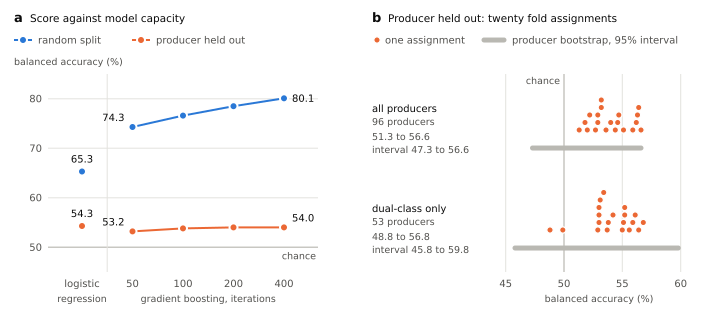

# Group-aware validation sharply reduces the apparent accuracy of extraction-category classification in public cannabis laboratory data

**Arthur Gonçalves Breguez**
Independent researcher
ORCID: 0009-0005-8551-731X
Correspondence: arthurbreguez@gmail.com

Preprint. Code and evidence logs:
<https://github.com/ArtBreguez/cannabis-extraction-ds>

---

## Abstract

Published models that classify cannabis products from cannabinoid and terpene
profiles report near-perfect accuracy: above 95% for resin type, 100% for
chemovar class. These figures come from random cross-validation or Kennard-Stone
partitioning, which hold out no plant, producer or laboratory.

We quantify the cost on a task whose group structure is explicit. On 33,229
public laboratory-result rows for cannabis concentrates that name a producer,
nearly all from Nevada, each with a source-declared extraction category
(non-solvent against solvent-based), a gradient-boosted classifier scores 78.5%
balanced accuracy and a ROC AUC of 0.89 under random five-fold cross-validation.
Holding out the producer leaves 54.0% and 0.62. A signal survives: the pooled
held-out AUC is 0.61, with a producer-level bootstrap interval of 0.535 to
0.698. But the reported model's pooled balanced accuracy does not separate from
chance (51.6%, interval 47.3 to 56.6); it keeps about 30% of its above-chance
AUC, and an unweighted logistic regression 41 to 53%.

A designed experiment shows the same direction: with the random split averaged
over 200 seeds, 162 HPLC-assayed samples fall from 54.3% to 38.9% under
leave-one-variety-out with gradient boosting and from 51.8% to 46.3% with
logistic regression, against 33.3% chance. In the market data the same profiles
identify the producer at 67.1% against a 14.4% baseline and the laboratory at
92.3% against 40.3%.

We conclude that the declared extraction category is only weakly recoverable
from these analyte panels for an unseen producer, and that a random split
overstates it by 8 to 25 points of balanced accuracy depending on the model. We
did not rerun the published studies.

**Keywords:** cannabis, chemometrics, data leakage, group cross-validation,
extraction category, laboratory testing data, model validation

---

## 1. Introduction

Cannabis chemical profiles are now routinely fed to supervised classifiers.
Reported performance is consistently high. A support vector machine separates
Dutch-type from Moroccan-type cannabis resin at 95.2% accuracy from two
cannabinoid concentrations [1]. Partial least squares discriminant analysis
assigns chemovar class from near-infrared spectra of whole inflorescences with
"100% prediction accuracy", sensitivity and specificity both 1.00 [2]. A
combined cannabinoid-and-terpene PLS-DA model reaches 0% prediction
misclassification across chemovars [3].

These numbers invite a question the papers do not ask: performance on *what*
unseen unit? A shuffled fold defines "unseen" as a row absent from the training
partition. Deployment defines it more strictly, as a plant, a producer, or a
laboratory the model has never encountered. When several rows descend from the
same entity, a random split lets the model recognise the entity instead of
learning the property of interest, and the reported score measures memorisation.

This failure mode is established in the general methodological literature [4, 5,
6, 7]; a related form, selection bias from choosing features outside the
cross-validation loop, was quantified in genomics more than two decades ago [8].
It has been described specifically for chemometrics, where Király and Tóth show
that the Kennard-Stone selection algorithm and the inappropriate handling of
repeated measurements both introduce train/test leakage [9]. The cannabis
applications cited above are exposed to it in different ways. Reference [2]
grows 88 genotypes cloned in triplicate to obtain 264 plants, then partitions
with Kennard-Stone [10] with no statement that the three clones of a genotype
were kept in one partition, on a 231/33 class split. Reference [1] evaluates
plain accuracy over five random 80/20 train/test iterations on a 149/40 class
split, where always answering the majority class already scores 78.8%; its two
classes also come from different countries and collection routes, retail
purchases in the Netherlands against seizures in north-east Italy, so class is
confounded with source. Reference [3] reports a 4% cross-validation error beside
its 0% prediction error and its abstract does not say how its prediction set was
drawn.

The bridge between the two literatures has not been built. We are not aware of a
published cannabis study that holds out the producer, the genotype or the
laboratory and reports what happens to the score.

We build that bridge on a concrete task. The question is whether a concentrate's
cannabinoid and terpene profile carries enough information to recover how it was
made, separating concentrates declared *non-solvent based*, which under the
Nevada rule in force since November 2020 means mechanical separation (hashish,
bubble hash and the like) or extraction with ethanol or CO2 [11], from those
declared *solvent based*, made with any other approved solvent. We keep the
shorthand `solventless` and `hydrocarbon` for the two declared categories
because the code and evidence logs use them; 2.1 reports what each category
contains. The task is a good test case for three reasons. The label is declared
at source rather than inferred. The group structure is explicit, since every row
names a laboratory and most name a producer. And a substantial subset of
producers make both classes, which permits a test where a held-out producer's
label cannot be read off the training rows.

We report a largely negative result for the chemical question and a quantitative
result for the methodological one.

## 2. Materials and methods

### 2.1 Data

**Market data.** The Cannlytics `cannabis_results` corpus [12] aggregates public
cannabis laboratory results obtained through public records requests and from
certificates of analysis published online, released under CC-BY-4.0. The
retrieved file contains 808,407 rows, of which 139,714 are concentrates or
extracts. None of the rows used here carries a certificate link, a batch number
or a strain name, and their `product_type` values read like track-and-trace item
categories (for example `Solvent Based Concentrate (Each)`), so we treat them as
a state laboratory-result export and not as parsed certificates. The `producer`
field is the licensee that the export records for the lot. We use it as the
group to hold out, without being able to tell a cultivator from a processor or a
packager.

Labels come from the `product_type` field, which in some markets declares the
extraction family directly as `non-solvent based concentrate` or `solvent based
concentrate`. This is a source-declared label, not an inference from a
commercial product name. Rows whose `product_type` is only `concentrate` remain
unlabelled and are never assigned to a class. The analyses run on the 37,344
labelled rows that survive the consistency check described below, which we call
the usable rows.

Most concentrate rows carry no such declaration and are therefore dropped at
this step, which is where the bulk of the reduction happens:

**Table 1.** From concentrate rows to labelled rows.

```
concentrate or extract rows                     139,714
  product_type declares the extraction family    37,310   (26.7%)
  product_type does not                         102,404   (73.3%)

labelled rows outside that subset                    64
total labelled rows                              37,374
```

The discarded majority is dominated by values that name a format rather than a
method: `extracts` (34,034 rows), `concentrate, product inhalable` (30,586),
bare `concentrate` (26,030) and `marijuana extract for inhalation` (3,901).
These are not missing labels to be recovered, since the extraction family was
never recorded, so imputing one would invent the dependent variable. Matching is
by regular expression (`non[- ]?solvent`) rather than exact string, which also
admits regional variants such as `non-solvent concentrate` (1,445 rows) and, in
64 cases, `infused pre-rolls (non-solvent)`. Those 64 rows are the reason the
labelled total slightly exceeds the declared count within the concentrate
subset; they are solventless by declaration but are pre-rolls rather than
concentrates, they are 0.17% of the labelled data, and none names a producer, so
they are outside the headline comparison.

A secondary labelling path applies regular expressions to `product_name` (`hash
rosin`, `live rosin`, `rosin` for solventless; `bho`, `butane`, `hydrocarbon`,
`live resin`, `shatter`, `badder`, `batter`, `wax` for hydrocarbon). The two
paths can only be compared on the 11.5% of labelled rows whose names carry one
of those words. Where both paths produce a label they agree on 4,259 of 4,289
rows, 99.3%. The 30 contradictory rows are excluded. The name path never adds a
row: it only cross-checks the declared label, so every labelled row carries a
`product_type` declaration.

The resulting labelled dataset is 37,374 rows, of which 30 carry contradictory
labels and are excluded from every analysis, leaving **37,344 rows** that all
figures below are computed on unless stated otherwise:

**Table 2.** Class counts on the usable rows.

```
hydrocarbon   24,573   65.8%
solventless   12,771   34.2%
```

Grouping variables are populated as follows:

**Table 3.** Grouping variables on the usable rows.

```
producer      33,229 rows (89.0%)   96 distinct
lab           37,344 rows (100.0%)  12 distinct
strain_name        0 rows (0.0%)     0 distinct
```

Every usable row that carries a `lab_state` is from Nevada: seven laboratories
and 31,422 of the usable rows (84.1%, and 94.6% of the rows that name a
producer). The field is blank for the remaining 5,922 rows, which come from five
laboratories, four that record no producer and one that does. No row names
another state, but the names of the four producer-less laboratories (one is
`Cannalytics RI`) suggest they are not in Nevada, in which case the rule cited
below does not govern their 4,115 rows. Tests are dated 2020-01-02 to 2024-03-29
on the 33,765 rows that carry a date; the producer-less rows are all dated from
December 2022 on.

Rows are not samples. 1,813 usable rows (4.9%) repeat another row on product
name, laboratory, producer and all 19 analyte values, but only 419 of them name
a producer; the other 1,394 are producer-less rows, which have no name and match
on a handful of analyte values. Separately, 1,303 samples from the producer-less
laboratories are stored as two adjacent rows each, with the same laboratory and
date and complementary analytes (`delta_9_thc` in one; `cbd`, `cbda`, `thca` and
`total_cbd` in the other), so those laboratories' 4,115 rows describe 2,812
samples. Among the rows that name a producer, 1,071 report nothing but a
`total_terpenes` of zero, in both classes, and two of the 96 producer strings
are spellings of one company (260 rows). We keep the rows as stored, since
nothing marks which copy is the record, and 3.2 reports the headline pair
without the duplicates, without the terpene-only rows and with the two spellings
merged. The split pairs lie outside the 33,229 rows that name a producer, on
which the headline comparison runs. Those rows are very unequally spread: the
largest producer holds 13.2% of them, the five largest 42.3%, and the median
producer 64 rows.

**What the label means.** The two categories are regulatory, not chemical.
Nevada's rule separates the same pair, and in its versions of July 2022 and
October 2023 defines it as "Extract of cannabis (nonsolvent) like hashish,
bubble hash, infused dairy butter, mixtures of extracted products or oils or
fats derived from natural sources, including concentrated cannabis extracted
with ethanol or CO2" against "Extract of cannabis (solvent-based) made with any
approved solvent, including concentrated cannabis extracted by means other than
with ethanol or CO2" [11]. The text effective November 2020 carries the same
pair of definitions, and the 2018 rule it replaced named CO2 only, so the first
ten months of the data fall under the older wording. Under the current
definition the non-solvent category spans mechanical separation, ethanol and
CO2, and the product names are consistent with that. Table 4 counts them over
the rows that carry a name, which are the 33,229 rows with a producer; a name
may hit several families.

**Table 4.** Product-name word families in each declared category, over the
33,229 named rows. Each family is a regular expression in
`src/evaluation/label_composition.py`; besides the words listed, the hydrocarbon
family matches `hydrocarbon` and `batter`, the mechanical one `solventless`, the
ethanol one `etoh` and the distillate one `disty`.

```
word family in product_name              non-solvent     solvent-based
distillate                               5,805 (51.5%)   8,258 (37.6%)
co2 / supercritical                        225 ( 2.0%)      19 ( 0.1%)
ethanol                                    163 ( 1.4%)     214 ( 1.0%)
hydrocarbon words                           43 ( 0.4%)   3,805 (17.3%)
  (bho, butane, live resin, shatter, badder, wax)
mechanical words                           559 ( 5.0%)     114 ( 0.5%)
  (rosin, hash, kief, bubble, ice water)
```

Only 5.0% of the named non-solvent rows contain a mechanical word, while 51.5%
are named `distillate`, a product that presupposes a crude extract and is not
how mechanical concentrates are sold, 2.0% name CO2 and 1.4% name ethanol. The
word families are crude. All 43 non-solvent rows that hit a hydrocarbon word
also say rosin, where badder and wax are consistencies, and the 114
solvent-based rows that hit a mechanical word contain hash, bubble or kief
inside cultivar names, none of them rosin. The table describes the two
categories; it cannot count mislabelled rows.

Neither the wording of the rule nor practice was constant over the period, and
they did not change together. Product names that say ethanol are almost all
solvent-based through 2022 (201 of 211) and mostly non-solvent in 2023 (133 of
146; Table 5), so the meaning of the label drifts within the data.

**Table 5.** Rows whose product name says ethanol, by year of test and declared
category. Dated rows only: 20 of the 163 non-solvent rows carry no date.

```
year    solvent-based   non-solvent
2020          82             9
2021          21             1
2022          98             0
2023          13           133
```

The task this paper tests is therefore the regulator's category as the
laboratories applied it over the four years, 2020 to 2023, that the rows naming
a producer cover, mechanical, ethanol or CO2 extraction against the remaining
solvents, and not rosin against BHO specifically; 3.2 reports the headline pair
on two narrower subsets.

**Controlled data.** Zenodo record 13823859 [13] is a designed experiment rather
than market data: six named varieties of non-psychoactive, CBD-type cannabis,
each extracted by three laboratory methods (maceration, ultrasound,
supercritical CO2) under varied time, temperature and pressure, with
cannabinoids quantified by HPLC. The record's description lists Soxhlet as the
third method; the data file labels it `Ultrasonido`, which we follow. The design
is fully balanced at 54 samples per method and 27 per variety, 162 total, with
four features (CBD, CBG, CBN, THC) and no missing values. Each sample is a
distinct (method, variety, time, temperature, pressure) cell, so there are no
replicates to leak across a random split; the chemotype also limits transfer to
THC-dominant concentrates. The process settings (time, temperature, pressure)
are not features: pressure alone identifies supercritical CO2, and adding the
three settings lifts the random split to 88.3%.

### 2.2 Feature construction

The source file carries 34 analyte columns. Fifteen are empty for every labelled
row and are dropped rather than imputed, since imputing a never-populated column
fabricates a feature. Nineteen analytes remain: eight cannabinoid columns
(`cbd`, `cbda`, `cbn`, `delta_8_thc`, `delta_9_thc`, `thca`, `total_cbd`,
`total_thc`), ten terpenes (`alpha_bisabolol`, `alpha_humulene`, `alpha_pinene`,
`beta_caryophyllene`, `beta_myrcene`, `beta_pinene`, `caryophyllene_oxide`,
`d_limonene`, `linalool`, `terpinolene`) and `total_terpenes`.

Non-detects require care. The corpus has already normalised `ND` and `<LOQ`
strings away, so only two cases remain:

- a numeric **zero** is a real measurement at or below the detection limit;
- an **empty** cell is an absence of information, either not tested or not
  reported.

These are not the same and must not be merged. The labelled dataset therefore
keeps two columns per analyte, the value and a boolean `_tested` mask, and rows
are never dropped for having gaps. The classifier receives the 19 value columns
with empty cells left missing, which the estimator routes natively at each
split, so the tested-versus-untested distinction reaches the model through
missingness rather than through the mask columns. The mask columns drive the
coverage figures below and the pre-check in 2.3.

This distinction produces two different and both meaningful coverage figures,
which we separate explicitly because conflating them is easy:

**Table 6.** Share of the rows that name a producer with the analyte tested and
with a non-zero value, by class.

```
analyte               tested (flag)          detected (value > 0)
                   solventless  hydro      solventless  hydro
d_limonene              85.8%   90.7%           46.1%   73.4%
beta_caryophyllene      85.8%   90.8%           53.3%   76.4%
alpha_pinene            85.8%   90.8%           38.8%   63.0%
total_terpenes         100.0%  100.0%           64.4%   83.4%
```

Terpene panels are requested at similar rates for both classes, a gap of 0 to 5
points. The large gap, 19 to 27 points, is in *detection*: hydrocarbon extracts
report a non-zero terpene value far more often. That gap is in what is reported
once a panel is run, not in which test was ordered, and with 51.5% of the named
non-solvent rows being distillates, refining is a likelier cause than the
extraction category itself. The panel is not constant over time either. Nevada
listed terpene analysis among the required tests for both categories in the text
effective November 2020 and no longer does in the July 2022 text [11], and among
the rows that name a producer the share with a terpene panel falls from 96.2% in
2020 and 96.5% in 2021 to 85.8% in 2022 and 72.0% in 2023.

Two properties of these columns are worth stating because they bound what the
features can mean.

First, `total_terpenes` is not an independent measurement. It is a near-exact
sum of the ten terpenes that survive the empty-column drop (R² = 0.984 against
their sum, Pearson r = 0.992), so it is collinear with features already in the
matrix and any per-feature importance attributed to it is split credit rather
than chemistry. Its residual against that sum is laboratory-specific: `CERTIFIED
AG LAB` reports an exact sum (within 10⁻⁶) on 99.7% of rows, `MA & ASSOCIATES`
on none, which makes the residual a laboratory fingerprint in its own right.
`total_thc` and `total_cbd` are derived columns of the same kind, each a fixed
combination of its acid and neutral forms. Dropping the column costs 0.3 points
of balanced accuracy under the all-rows random split, so nothing in this paper
depends on keeping it; we keep it because the published literature does.

Second, whether `total_terpenes` is populated at all is a laboratory
convention, not a per-sample decision. Every laboratory is at 0% or 100%, with
no intermediate value, and the populated set is *exactly* the set of rows that
carry a producer:

```
total_terpenes populated == producer present:  33,229 / 33,229 rows, no exceptions
laboratories at 100%:  G3, NV CANN, DB, CERTIFIED AG, DPL NV, ERP, 374, MA
laboratories at   0%:  PureVita, Cannalytics RI, Lifted Testing, Green Peaks
```

So `total_terpenes` being blank is an exact in-model indicator of "this row will
be dropped by the unseen-producer scheme". That coupling is why the headline
comparison in 3.2 is made on the rows that name a producer.

Finally, 101 rows carry a `total_thc` above 100%, which is impossible as a
percentage; the largest is 686,400, a milligram figure in a percent column.
Ninety-four come from a single laboratory. They are 0.27% of the corpus and we
leave them in place rather than silently editing source measurements, but they
are unit artefacts rather than chemistry and no claim here rests on them.

### 2.3 The leakage pre-check

A detection gap of 19 to 27 points is a candidate shortcut. If the pattern of
which terpenes were reported, or reported as non-zero, tracked the class, a
classifier could score well while reading the reporting convention rather than
the chemistry. We measured this before modelling rather than assuming it away.

A classifier given **only the missingness pattern** of the 19 analyte columns
the model sees, with every measured value discarded, reaches 69.9% accuracy
against a 65.8% majority-class baseline: a lift of **+4.1 points**. Adding
laboratory identity as an explicit feature reaches 70.5%, a further 0.6 points.
Those are in-sample figures for the lookup. Cross-validated, the probe scores
69.8% plain and 56.8% balanced accuracy, against 84.1% plain and 81.0% balanced
for the main model under a random split, so on the rows as stored the shortcut
is 4.0 of 18.3 points on one metric and 6.8 of 31.0 on the other.

That 4.1-point lift is not spread evenly. The 19 columns take only 13 distinct
missingness patterns, and 7 of them are **100% one class**:

**Table 7.** Missingness patterns that contain a single class, rows as stored;
the three largest of the seven are listed.

```
patterns that are 100% one class: 7 of 13
rows they cover:                  4123 (11.04%)
  n= 1495  all solventless (6 of 19 analytes reported)
  n= 1303  all hydrocarbon (1 of 19 analytes reported)
  n= 1303  all hydrocarbon (4 of 19 analytes reported)
```

For 11% of the usable rows the label is recoverable with certainty from which
cells are blank, before any number is read. Almost all of these rows, 4,115 of
4,123, come from four laboratories (`PureVita`, `Cannalytics RI`, `Lifted
Testing`, `Green Peaks`) that report a restricted analyte panel and record no
producer, so the shortcut is a laboratory reporting convention and not
chemistry. Much of it is an artefact of the split records of 2.1: the rows
reporting one analyte and the rows reporting four are the two halves of the same
1,303 samples (1,230 of them at `PureVita`), all solvent-based, while the rows
reporting six are all non-solvent. With each pair merged the columns take 12
patterns, 6 of them pure, covering 2,820 rows (7.82%), and the in-sample lookup
scores 68.8% against a 64.6% majority. The remaining 8 rows sit in three rare
patterns from other laboratories and do carry a producer; 14 of the pure rows
report no analyte at all and stay in the data. The 4,115 producer-less rows are
also the rows the unseen-producer scheme must drop, which is why the headline
comparison in 3.2 is made without them.

Laboratory and class are not degenerate, though they are far from independent.
Only 373 rows, 1.0%, sit in laboratories that are more than 90% one class, and
the two largest laboratories, 15,018 and 12,531 rows, both sit close to the
overall 65.8/34.2 split; across all twelve the hydrocarbon share runs from 0.0%
to 97.8%, and 3.2 gives the range for the eight largest.

The cheapest shortcut therefore buys about 4 points, concentrated in 11% of the
rows and attributable to reporting convention. That is small enough that a model
scoring in the eighties cannot be running on it alone, which is what made the
main experiment worth running, but it is not nothing, and 3.2 reports what
happens when those rows are excluded.

### 2.4 Model and split schemes

A single model produces every headline figure: `HistGradientBoostingClassifier`
(scikit-learn 1.9.1 [14]), `max_iter=200`, seed 20260921, early stopping
disabled, fed the 19 analyte columns of 2.2. The point of the study is the
evaluation protocol, not the estimator, so the estimator is held constant across
all schemes and no hyperparameter is tuned; 3.2 varies its capacity instead. The
alarm probes of 2.6 use the same estimator at `max_iter=120` and a learning rate
of 0.05, for the reason given there. A standardised logistic regression (L2
penalty, C = 1) is run beside it in 3.2 and 3.3 as a low-capacity comparator.
Since a linear model cannot route missing values, on the market data it receives
log(1 + x) of each value with empty cells set to zero, plus one reported-or-not
indicator per analyte. The headline model is unweighted, so 3.2 also runs both
estimators with class weights inversely proportional to class frequency.

Four split schemes are compared on the market data:

1. **random**: stratified five-fold, the family of protocol that [1] uses;
2. **unseen-producer**: `GroupKFold` grouped by producer string, so no
   producer string appears in both train and test;
3. **unseen-lab**: leave-one-lab-out. Each fold holds out one entire
   laboratory. Only laboratories with at least 500 rows are eligible to be
   held out, because a fold testing on a 100-row laboratory estimates nothing;
   8 of the 12 laboratories clear that floor and all 8 contain both classes,
   giving 8 folds. The 4 excluded laboratories hold 561 rows, 1.50% of the
   data, and they are still present in every training set;
4. **dual-class + unseen**: restricted to the 53 producers that make *both*
   classes, grouped by producer.

Scheme 4 is the strictest available test. Restricting to producers who make both
classes removes the degenerate case where a producer's identity determines its
label outright, but it does not make producer identity uninformative: the
solventless share across these 53 producers ranges from below 0.01 to 0.99 with
a median of 0.35, and 30 of the 53 sit outside the 0.2 to 0.8 band. A classifier
given *only* an encoded producer ID, and no chemistry at all, still reaches
84.4% balanced accuracy inside this subset under a random split. What the
restriction guarantees is that the held-out producer's label cannot be inferred
from having seen that same producer in training, since every producer in the
subset contributes both classes. It covers 27,751 rows, 74.3% of the usable
data, with a 17,312 / 10,439 class split.

Three further analyses in 3.2 run on the rows that name a producer. Twenty
reassignments repeat scheme 2 with the producers shuffled into folds,
`GroupKFold(5, shuffle=True)` with seeds 0 to 19. A temporal split sorts the
dated producer rows by `date_tested`, fits once on the earliest 80% and tests on
the rest, without grouping; rows dated on the boundary day can fall on either
side. A positive control replaces the target with whether the product name says
distillate and runs schemes 1 and 2 unchanged.

On the controlled data, random five-fold is compared against
leave-one-variety-out.

### 2.5 Metrics

The classes are roughly 1:2, so the extraction task is scored by balanced
accuracy; where plain accuracy appears, in the 2.3 probe and the alarm probes of
2.6, it is given beside its majority-class baseline. Balanced accuracy has a
chance level of 50.0% for two classes and 33.3% for three. Because it is
computed at the default decision threshold, which an unweighted model on
unbalanced classes does not place well, 3.2 also reports ROC AUC, which needs no
threshold and has a chance level of 0.5. We also report macro F1, per-class
recall, a confusion matrix, and the spread across folds. Every "+/-" in a table
is the population standard deviation of the fold scores (divisor n).
Producer-level intervals are percentile intervals over 2,000 bootstrap draws of
producers, computed from the held-out predictions of the reported partition
without refitting. A draw that contains one class only is skipped, and for a
fold-mean statistic a fold that loses a class in a draw is left out of that
draw's mean. We report eighteen such intervals, sixteen pooled (Table 11) and
two on the fold mean (3.2, Figure 1b), without a multiplicity correction and
call a bound within two points of chance marginal. Two baselines are computed
explicitly: most-frequent (balanced accuracy 50.0%) and stratified random (50.7%
on the one draw made, 50.0% in expectation). The alarm probes of 2.6 are
multi-class and report plain accuracy against the explicit majority-class
baseline of their target, with balanced accuracy beside it.

Per-class recall matters here because a single aggregate figure hides which side
of the problem the model actually solves.

### 2.6 Alarm models

Before the main task, two probes asked whether the chemistry predicts metadata
it should not: the testing laboratory and the producer. A profile that
identifies the laboratory is a profile that partially encodes instrumentation,
calibration and reporting convention, which would compromise any score obtained
while train and test share laboratories. A third target, cultivar, has no
reliable field in this corpus and could only be probed on a key reconstructed
from product names; that probe and its limits are reported in 4.3.

Each probe keeps only classes with enough rows to be estimable, since a class
with 20 members contributes noise rather than signal: at least 100 rows for the
laboratory probe and 150 for the producer probe, the latter higher because
producers are far more numerous. These floors, applied after the 30 conflicting
rows are dropped, are why the probes in 3.1 run on 11 of 12 laboratories
(37,276 rows) and 33 of 96 producers (30,416 rows) rather than on the full
dataset. The probes receive the same 19 value columns as the main model, with
empty cells left missing, so a laboratory's analyte panel is visible to them
alongside its measured values. The laboratory probe therefore measures
instrument and reporting convention together, which is the quantity that
matters for a split that shares laboratories; 2.3 measures the reporting
convention on its own, and 3.1 reports a missingness-only laboratory probe
beside the chemical one.

The probes are multi-class, 11 and 33 classes, and the softmax boosting diverges
on them at scikit-learn's default learning rate of 0.1: the laboratory probe's
five folds score 40.6 to 69.4 and the producer probe's 10.4 to 68.7. At a
learning rate of 0.05 the fold scores span 0.6 points for the laboratory and 1.6
for the producer, and those are the figures reported in 3.1. The binary
extraction task is less sensitive and keeps the default: on all usable rows its
random split scores 81.0% at the default rate and 79.0% at 0.05, with fold
spreads of 0.4 and 0.5, and on the producer rows the held-out score is 54.0% and
54.1%.

## 3. Results

### 3.1 The profiles identify the laboratory and the producer

**Table 8.** Alarm probes: predicting metadata from the 19 analyte columns,
random five-fold.

```
target   classes    rows  accuracy        baseline  lift       bal_acc (chance)
lab           11  37,276  92.3% (+/-0.2)    40.3%  +52.0 pts  76.3% (9.1%)
producer      33  30,416  67.1% (+/-0.6)    14.4%  +52.7 pts  53.4% (3.0%)
```

The chemical profile identifies the testing laboratory on 92.3% of rows, 52.0
points above the majority baseline, and the producer on 67.1%, 52.7 points above
its own. Part of the laboratory signal is the reporting panel: a lookup table on
the 13 missingness patterns alone, with no measured value, reaches 57.3% on the
same folds, so the measured values add a further 35 points. The fingerprint is
not producer memorisation either: grouped by producer on the seven laboratories
with at least 100 rows that record one (33,161 rows), the laboratory probe
scores 85.4% (+/-3.3) against a 45.3% baseline. This is expected, since
instruments, calibration, reporting conventions and clientele all differ between
laboratories, and this probe cannot separate them. The consequence is that any
score obtained while train and test share laboratories is partly reading a
laboratory-specific signal. With the split pairs of 2.1 merged the laboratory
probe is unchanged at 92.3%, on ten laboratories and a 41.9% baseline.

### 3.2 Market data: 78.5% becomes 54.0%

**Table 9.** The reported model under each split scheme. `random (optimistic)`
and the two baselines run on all usable rows; the row below it repeats the
random split on the rows that name a producer.

```
split scheme            balanced_acc    macro_F1   folds
most-frequent baseline       50.0%           --      --
stratified baseline          50.7%           --      --
random (optimistic)          81.0% (+/-0.4)   81.8%      5
random, producer rows        78.5% (+/-0.4)      --      5
unseen-producer              54.0% (+/-5.6)   50.3%      5
unseen-lab                   68.3% (+/-18.6)  67.6%      8
dual-class + unseen          54.6% (+/-2.6)   50.7%      5
```

The `random (optimistic)` row runs on all 37,344 usable rows and the two
producer schemes only on rows that name a producer, so 81.0% and 54.0% are not
like with like. On the same 33,229 rows the random split scores 78.5%, and that
pair, 78.5% against 54.0%, a gap of **24.4 points** on the unrounded means, is
the headline of this paper. The 81.0% includes the 4,115 producer-less rows,
which carry the reporting-panel shortcut of 2.3 and the 1,303 samples stored
twice (2.1); with those pairs merged it is 80.4%.

How far above chance the held-out score sits depends on how it is measured. The
reported model is unweighted and the classes are roughly 1:2, so held out it
answers mostly with the majority class, and balanced accuracy at the default
threshold understates what its scores contain. Table 10 adds ROC AUC and class
weighting, and Table 11 gives the pooled scores with their producer bootstrap
intervals.

**Table 10.** Four models on the rows that name a producer: fold means under the
random split and with the producer held out.

```
producer rows (33,229)     random split     producer held out
model                      bal_acc   AUC    bal_acc         AUC
boosting, unweighted        78.5%  0.894    54.0% (+/-5.6)  0.625
boosting, class-weighted    80.6%  0.894    55.8% (+/-5.5)  0.621
logistic, unweighted        65.3%  0.753    54.3% (+/-6.2)  0.634
logistic, class-weighted    69.4%  0.752    61.1% (+/-5.1)  0.636
```

**Table 11.** Producer held out: scores pooled over the held-out predictions of
the reported partition, with producer bootstrap 95% intervals.

```
pooled, held out               bal_acc              AUC
producer rows (33,229)
  boosting, unweighted         51.6% [47.3, 56.6]   0.610 [0.535, 0.698]
  boosting, class-weighted     56.8% [50.3, 63.0]   0.630 [0.551, 0.715]
  logistic, unweighted         49.0% [43.0, 57.4]   0.604 [0.519, 0.696]
  logistic, class-weighted     64.9% [56.8, 71.9]   0.662 [0.571, 0.745]
dual-class rows (27,751)
  boosting, unweighted         52.0% [45.8, 59.8]   0.594 [0.497, 0.704]
  boosting, class-weighted     56.1% [48.2, 63.8]   0.615 [0.509, 0.723]
  logistic, unweighted         51.7% [44.3, 60.7]   0.583 [0.480, 0.710]
  logistic, class-weighted     61.2% [48.7, 71.6]   0.646 [0.519, 0.759]
```

Three things follow. First, a ranking signal transfers across producers: every
model's held-out AUC is 0.62 to 0.64 as a fold mean, and on the producer rows
the producer bootstrap interval of the pooled AUC excludes 0.5 for all four,
marginally for the unweighted logistic model. Second, it is modest and does not
always survive thresholding. The boosted models keep about 30% of the
above-chance AUC the random split shows, 0.125 of 0.394 on fold means and 0.110
of 0.394 pooled for the reported one, the unweighted logistic model 41 to 53%,
0.134 and 0.104 of 0.253, and the class-weighted one 54 to 64%, 0.136 and 0.162
of 0.252, both from a much lower start. The pooled balanced accuracy of both
unweighted models has an interval that includes 50%, and the unweighted logistic
model's point estimate, 49.0%, is below it; only the class-weighted models clear
chance, the boosted one marginally. For the reported model the fold-mean
balanced accuracy of 54.0% has a producer bootstrap interval of [50.2, 58.9].
Third, the size of the loss depends on the estimator, on its capacity (Figure
1a) and on class weighting: 24.4 points for unweighted boosting, 24.8 with class
weights, 11.0 for an unweighted logistic regression and 8.3 for a class-weighted
one, whose held-out 61.1% is the highest fold-mean score of the four models.

The reported partition is one draw, and refitting on others moves the score.
Twenty random reassignments of producers to folds (Figure 1b) give the reported
model means from 51.3% to 56.6% (median 53.8%, sd 1.7; AUC 0.603 to 0.658) and
the class-weighted one 53.0% to 59.9% (median 55.5%, AUC 0.602 to 0.664); none
falls to 50.0%. The five folds of the reported partition score 48.6, 57.6, 46.7,
55.7 and 61.5. Laboratory identity alone, as a lookup under the same folds,
scores 43.6%, below 50 because a laboratory's majority class among the training
producers is a poor guide to the held-out ones, so the points above chance are
not a laboratory prior.



**Figure 1.** Balanced accuracy on the rows that name a producer, unweighted
models. (a) Random split and producer-held-out score, for a standardised
logistic regression and for gradient boosting at four iteration counts; fold
means; the fold spreads of the reported and logistic models are in Table 10. (b)
Mean score of each of twenty random assignments of producers to folds, for all
producers and for the dual-class subset; the bar is the producer bootstrap 95%
interval of the fold-mean score on the reported partition and the tick is that
score. Every plotted value is parsed from the evidence logs by
`src/evaluation/make_figure.py`.

**Table 12.** Robustness of the gap. Balanced accuracy of the reported model;
gap in points on unrounded means. The last row replaces the target (2.4).

```
check (producer rows, reported model)       random   held out    gap
reported: 200 boosting iterations           78.5%    54.0%     24.4
random-split seeds 1, 7, 12345                                 24.6, 24.5, 24.6
50 iterations                               74.3%    53.2%     21.1
100 iterations                              76.6%    53.8%     22.7
400 iterations                              80.1%    54.0%     26.1
419 duplicate rows dropped                  78.9%    55.2%     23.7
1,071 terpene-only rows dropped             79.4%    55.1%     24.3
two producer spellings merged                        54.7%
tested 2020-2022 only (23,461)              81.1%    52.6%     28.4
tested 2023 only (6,189)                    83.5%    53.0%     30.5
rows not named distillate (19,166)          84.1%    60.6%     23.5
rows named for a process (4,345)            77.0%    60.3%     16.8
positive control: named distillate or not   89.6%    76.4%     13.2
```

Table 12 varies what could be suspected of producing the gap. It is stable under
reseeding of the random split. It grows with model capacity while the held-out
score does not move (Figure 1a), so 24.4 is one point on a curve from 21.1 to
26.1. Duplicate rows, rows that report only a zero terpene total and the two
spellings of one producer do not produce it. Nor does the drift in the label and
the panel (2.1, 2.2): the gap is 28.4 points on the rows tested in 2020 to 2022
and 30.5 on those tested in 2023. Two narrower definitions of the label keep
more when held out, near 60% on a single partition each with fold spreads of 8.7
and 6.2: the rows not named distillate, and the rows whose names hit the
mechanical family in the non-solvent class or the hydrocarbon family in the
solvent-based class (leaving out the 19 solvent-based rows that also hit a
mechanical word), the closest this corpus comes to rosin against BHO. The
positive control shows that the hold-out does not destroy a score by itself:
whether a row is named distillate, a target with a known chemical signature, is
recovered at 76.4% for unseen producers.

Time has a cost of its own. Training on the earliest 80% of the dated producer
rows and testing on the latest 20%, with 95.3% of the test rows from producers
seen in training, scores 58.3% with an AUC of 0.754, against 79.5% and 0.902 for
a random five-fold split of the same 29,650 rows. Balanced accuracy falls almost
as far as under the producer hold-out and the AUC about half as far. Inside 2020
to 2022 the same split scores 64.6% with an AUC of 0.709. The two hold-outs are
not interchangeable, and a model deployed on new producers at a later date would
face both.

The strictest test agrees on the size of the loss. The dual-class subset scores
54.6% (+/-2.6) held out against 80.3% (+/-0.7) for a random split on the same
27,751 rows, a gap of 25.6 points on the unrounded means, and its AUC falls from
0.899 to 0.632. Its five folds on the reported partition are 54.1, 58.5, 53.2,
56.4 and 50.9, and the producer bootstrap of their mean spans [48.4, 61.9];
twenty reassignments give means from 48.8% to 56.8% (median 54.0%), two of them
at or below 50.0%. On this subset no model's pooled balanced accuracy has an
interval that excludes 50%, and only the class-weighted models' pooled AUC
intervals exclude 0.5, marginally (Table 11). Laboratory identity alone scores
40.8% under the same folds. Macro F1 is 50.3% (+/-4.3) and 50.7% (+/-3.1) on the
two schemes, against 39.8% and 38.4% for the majority predictor and 49.6% and
49.4% for a stratified shuffle on each scheme's own rows, so on that thresholded
metric neither beats a stratified guess.

The confusion matrix shows where the apparent skill was concentrated:

**Table 13.** Pooled confusion matrix of the reported model, producer held out.

```
unseen-producer     true hydrocarbon: 16,149 correct /  5,818 wrong
                    true solventless:  3,332 correct /  7,930 wrong
```

Solventless recall is **32.3%** as the mean of the five per-fold recalls and
3,332 / 11,262 = **29.6%** pooled. The two differ because the folds carry very
unequal numbers of solventless rows, from 951 to 4,413, and the fold with the
fewest has the highest recall (48.5% against 25.3% in the fold with the most).
The pooled matrix gives a balanced accuracy of 51.6%. For comparison, the
per-class recalls are 89.8% and 67.1% under the random split on the same rows,
and 69.9% and 39.3% on the dual-class subset grouped by producer. The model
mostly answers with the majority class, and its residual skill lives on the easy
side.

**Holding out the laboratory.** The `unseen-lab` scheme has the highest mean of
the three group-held-out schemes, 68.3%, and a fold-to-fold standard deviation
of **18.6 points**: the score depends on which laboratory is held out. Across
the eight held-out laboratories the hydrocarbon share ranges from 13.5%
(`Cannalytics RI`, 758 rows) to 78.4% (`PureVita`, 3,137 rows), against an
overall 65.8%, so holding out a laboratory shifts the test-set prior as well as
the instrument, and the two effects cannot be separated with these data. With
the split pairs of 2.1 merged the scheme scores 67.4% (+/-19.3). We report it
for completeness and do not rest any conclusion on it.

### 3.3 Controlled experiment: the same direction, an estimator-dependent size

**Table 14.** Controlled experiment, gradient boosting.

```
split scheme              balanced_acc    macro_F1   folds
chance level (3 classes)       33.3%           --      --
random 5-fold                  56.7% (+/-9.2)   55.7%      5
leave-one-variety-out          38.9% (+/-12.6)  35.9%      6
```

With gradient boosting, a random split suggests method is somewhat separable at
56.7%, and holding out an entire variety gives **38.9%**, 5.6 points above
chance with a fold spread of 12.6 that straddles it. That is the market-data
pattern with the held-out group changed from producer to variety. The mechanism
is not the same: the design is balanced and has no replicates, so nothing leaks
across a random split here, and what the variety hold-out measures is a shift
between varieties. Nor does the drop survive a change of estimator intact:

**Table 15.** Controlled experiment, logistic regression.

```
logistic regression       balanced_acc
random 5-fold                  54.3% (+/-2.5)
leave-one-variety-out          46.3% (+/-10.2)
```

A standardised logistic regression on the same folds drops 8.0 points instead of
17.8, which is inside its fold spread of 10.2, to a score that is above chance:
1 of 1,000 label shuffles reaches 46.3% (p = 0.002). Four features and about 130
training samples are a setting where a boosted ensemble can overfit each variety
and a linear model cannot, so part of the boosted collapse belongs to the
estimator. What both estimators agree on is the direction, and that the method
signal which transfers across varieties is modest.

The variety is easier to read than the method:

```
chemistry -> variety:  balanced_acc 60.7% (+/-8.3)   chance 16.7%
```

Under the same random split the four cannabinoids predict the **variety** at 3.6
times chance with gradient boosting (60.7%) and 2.8 times with logistic
regression (46.9%), against 1.7 and 1.6 times chance for the method. Even in an
experiment built to isolate method, with clean HPLC numbers, the variety, which
here also means the batch of starting material, is read more easily than the
method.

Three checks qualify the boosted figures, each recomputed from the raw file.
First, the random-split score depends on the seed: over 200 seeds, five-fold
scores average 54.3% (sd 2.7) and the reported 56.7% sits at the 80th
percentile, so the seed-robust gap to leave-one-variety-out is 15.4 points
rather than 17.8; for logistic regression the 200-seed average is 51.8% (sd 2.3)
and the gap 5.5. Second, the drop comes from the variety structure and not from
the fold count: holding out six groups of 27 samples assigned at random, which
keeps the fold geometry and breaks the variety link, averages 54.0% over 200
draws and never falls to 38.9%. Third, a permutation test over 300 global label
shuffles, which also break the balanced design, gives p = 0.0033 for the random
split, the floor for 300 shuffles, and p = 0.11 for leave-one-variety-out, so
the boosted grouped score is not distinguishable from chance.

This matters for interpretation. The Cannlytics result alone could be dismissed
as a consequence of messy market data. The controlled experiment shows the same
direction on clean data, and it also shows that the size of a collapse is a
property of the estimator as well as of the data.

## 4. Discussion

### 4.1 What this establishes

Two claims, of different kinds.

The **chemical claim** is narrow: the analyte panels of this corpus, 19 columns
of which three are derived totals, heavily left-censored, carry only a weak
signal of the declared extraction category, non-solvent against solvent-based
(2.1), for a producer the model has never seen: an AUC of 0.62 against 0.89
under a random split, and 54 to 61% balanced accuracy depending on the estimator
and on class weighting. Producer variation dominates whatever method signal
exists: on the dual-class rows under a random split, a classifier given only an
encoded producer ID reaches 84.4% and the chemistry 80.3%, while the chemistry
grouped by producer reaches 54.6%. Cultivar plausibly does the same, but the two
datasets disagree on the evidence and we do not claim it for the market corpus:
in the controlled experiment the four cannabinoids read variety at 60.7% against
16.7% chance while reading method at 38.9% against 33.3% (46.9% and 46.3% with
logistic regression), whereas in the market data the chemistry reads our
reconstructed strain key only weakly, 9.9 points above its baseline (4.3).

The **methodological claim** is general and, we think, the more useful one.
Cannabis chemical data has group structure, and the validation protocols in use
ignore it, a concern raised in general terms by [9] and given a size here. Two
independent datasets, one market and one designed, both lose performance when
the group is held out: on the market data 24 to 25 points of balanced accuracy
with gradient boosting and 8 to 11 with logistic regression, and 0.27 of AUC for
the reported model; on the designed experiment 15 to 18 points with gradient
boosting and 5 to 8 with logistic regression. The mechanisms differ. In the
market data the same producers sit on both sides of a random split; the designed
experiment has no replicates, and its drop is a shift between varieties. The
market gap is not produced by the 2023 change in labelling, since it is as large
on the rows tested in 2020 to 2022 as overall; drift inside that window is not
excluded. What the random split rewards is largely group identity, which the
same profiles carry strongly: producer at 67.1% against a 14.4% baseline,
laboratory at 92.3% against 40.3%, variety at 3.6 times chance.

### 4.2 What this does not establish

**Not** that extraction method leaves no chemical trace. Controlled studies with
fixed genetics and fixed instrumentation measure method effects directly, and
3.3 reproduces one such effect under a random split; this work does not
contradict them.

**Not** that a better model would fail. Only that these features generalise
weakly across producers. A richer assay, a full terpene panel or an LC-MS
fingerprint, is a different experiment.

**Not** that the labels are wrong, and not that they are clean. They are
source-declared and agree with the name-derived path on 99.3% of the 11.5% of
rows where both exist; that check covers eleven name patterns only, three for
rosin and eight for hydrocarbon products. Product names cannot count mislabelled
rows (2.1), and the treatment of ethanol extracts changed within the period
(Table 5). What the labels mean is the regulator's category as applied (2.1),
which is wider than the rosin-and-hash reading of "solventless": 3.2 gives the
result on the rows that come closest to rosin against BHO, and a reader who
wants that comparison specifically should rely on those and not on the headline.

**Not** chance, but close to it. On the producer rows the pooled AUC interval
excludes 0.5 for all four models, and the pooled balanced-accuracy interval
excludes 50% only for the class-weighted ones. On the dual-class subset no
balanced-accuracy interval excludes chance, and only the class-weighted models'
AUC intervals do (Table 11). Several of these bounds are marginal. The claim is
about the size of the inflation, not that nothing transfers.

**Not** a joint hold-out. No scheme here holds out the producer and the
laboratory together: the two largest laboratories hold 83% of the rows that
carry a producer, so such a split cannot be built from this corpus.

**Not** a claim about the correctness of the conclusions in [1], [2] or [3].
Their chemical findings may well hold. What we show is that the performance
figures of [1] and [2] are obtained under validation that leaves group structure
intact, a family of protocols in which we measure substantial inflation for the
random-split member, and so cannot be read as estimates of performance on a new
producer, genotype or laboratory. We could not establish the protocol of [3]
from its abstract.

### 4.3 The confounder we could not test cleanly

Strain is the obvious remaining candidate. Extraction routes are not applied to
the same cultivars at the same rates, so the declared category may partly encode
which cultivar was used, and cultivar drives terpene profile directly.

We could not test it cleanly. The `strain_name` and `strain_type` columns exist
in the source file but are populated for **0 of 37,344** usable rows. The only
cultivar signal left is in `product_name`, and a strain key extracted from it is
too dirty to carry a confounder probe:

**Table 16.** What a strain key extracted from product names contains.

```
usable rows                                     37,344
  no cultivar key extractable at all             4,717   (12.6%)
  key extracted                                 32,627   (87.4%)
    of those, an obvious non-cultivar word       7,386   (22.6% of keys)
    (oil, thc, lab sample, acres, ethanol, raw)
rows yielding no usable cultivar signal         12,103   (32.4% of usable)
```

The 4,717 rows with no key are the 4,115 producer-less rows, which have no
product name, and 602 named ones; nearly a quarter of the keys that do parse are
packaging or process words rather than cultivar names.

For completeness: grouping the method task by strain key gives 66.2% balanced
accuracy (+/-1.6), against 79.2% for a random split on the keyed rows, and
restricting to the 214 keys that appear in both classes, 9,598 rows, gives 56.9%
(+/-11.4), against 83.6%, with a macro F1 of 42.8%. An alarm probe in the sense
of 2.6, predicting the key from chemistry on the 109 keys with at least 30 rows
(12,829 rows), gives 32.4% against a 22.5% baseline, a lift of 9.9 points, where
the majority key is the non-cultivar word `oil`. We rest no conclusion on any of
the three: a 22.6%-contaminated grouping key makes the fold composition partly
arbitrary. The strain question is open and cannot be answered with this corpus
alone.

### 4.4 Recommendations

For anyone fitting a classifier to cannabis chemical data:

1. **Group by the entity production will hand you fresh.** Producer, genotype,
   laboratory. `GroupKFold` and `LeaveOneGroupOut` cost nothing to run.
2. **Report the random-split score alongside the grouped one.** The gap is the
   informative quantity and is cheap to obtain.
3. **Never report plain accuracy without its majority-class baseline.**
   Reference [1]'s 95.2% sits on a 78.8% baseline, so the lift is 16.4 points.
4. **Report per-class recall and the between-fold spread.** Our `unseen-lab`
   mean of 68.3% carries a standard deviation of 18.6; the mean alone is
   misleading.
5. **Run an alarm model before the real task.** If the chemistry predicts the
   laboratory, any laboratory-sharing score is partly laboratory-specific.
6. **Keep a tested-versus-detected distinction in censored panels.** Merging a
   measured zero with a missing cell changes the coverage gap in our data from
   0 to 5 points to 19 to 27.
7. **Report the gap for more than one estimator.** Here it runs from 21 to 26
   points across boosting iterations and is 8 to 11 for a linear model.
8. **Report a threshold-free metric and a class-weighted model.** Our
   unweighted model's held-out 54.0% hides an AUC of 0.62; class weighting
   alone moves a linear model from 54.3% to 61.1%.

### 4.5 Where a decisive answer would come from

The remaining untested avenue is a method-comparison dataset pairing extraction
method with a full metabolomic fingerprint including terpenes, of the kind held
in public LC-MS and GC-MS repositories such as MassIVE. That alone could
distinguish "method leaves no usable trace" from "method leaves a trace, but not
in the 4-cannabinoid or 19-analyte projections tested here".

## 5. Conclusion

The declared extraction category, non-solvent against solvent-based, is only
weakly identifiable from the cannabinoid and terpene panels of this corpus of
public laboratory results for an unseen producer. On the rows that name a
producer, a random split reports 78.5% balanced accuracy and an AUC of 0.89;
holding out the producer leaves 54.0% (51 to 57% across twenty fold assignments)
and 0.62. Pooled over held-out producers the AUC is 0.61, with a producer-level
bootstrap interval of 0.535 to 0.698 that excludes chance, while the reported
model's pooled balanced accuracy, 51.6%, does not. A designed HPLC experiment
shows the same direction when variety is held out, and the same profiles
identify the producer and the laboratory far above their baselines.

The published accuracies cited here, 95% and 100%, are obtained under validation
that holds out no group, the family of protocols for which we measure 24 to 25
points of inflation on market data and 15 to 18 on a designed experiment with
gradient boosting, and 8 to 11 and 5 to 8 with a linear model. We ran random
cross-validation, not Kennard-Stone selection, so the magnitude we report is
specific to the former; what the two share is that neither holds out the
producer, the genotype or the laboratory. We do not claim the published chemical
conclusions are wrong, and we did not rerun those studies. We claim their
numbers do not answer the question a reader will assume they answer. Group-aware
validation is not a refinement here. It changes the size of the result by 8 to
25 points.

## Data and code availability

Source data are public and are not redistributed here. The Cannlytics
`cannabis_results` corpus [12] and Zenodo record 13823859 [13] are both
CC-BY-4.0. The corpus is retrieved by `src/ingestion/fetch_cannlytics.py`, which
verifies the downloaded size against the figure declared by the host API; the
Zenodo file was downloaded by hand. The check matters: an early download
truncated to 7% of its size, 177.9 MB of 2,534.8 MB, opened without error and
was caught only by that check.

All analysis code and the raw evidence log for every run described in this
manuscript are public at
<https://github.com/ArtBreguez/cannabis-extraction-ds> (code MIT, manuscript
CC-BY-4.0). The structure is:

```
src/ingestion/      retrieval with download-integrity verification
src/preprocessing/  labelling, unit checks, non-detect encoding
src/models/         the four split schemes and the alarm probes
src/evaluation/     recomputation and audit of every figure reported here
docs/evidence/      raw stdout of each run, committed unedited
```

A single script, `src/evaluation/rederive_paper_numbers.py`, recomputes every
dataset figure in this manuscript directly from the labelled dataset, and
`src/evaluation/audit_preprint.py` checks each claimed number in this text
against either that recomputation or the committed log, failing on any
disagreement. The repository state that matches this manuscript is tagged
`preprint-v1`.

## Author contributions

A.G.B. is the sole author and is responsible for the conceptualisation, data
curation, formal analysis, methodology, software, validation, visualisation and
writing of this work. The assistance of AI tools is described below.

## Funding

This work received no funding.

## Competing interests

The author produces cannabis-related content on social media under the handle
@HiddenTerps and has a commercial interest in mechanically separated
(solventless) extracts, which fall inside the non-solvent category studied here.
This work reports that the category is only weakly recoverable from routine
laboratory panels, which runs against that interest rather than supporting it.

## Use of AI tools

AI coding assistants were used throughout this work, under the author's
direction and review. Their contribution was to the analysis code, the
verification harness and the manuscript prose: writing and refactoring the
scripts in `src/`, running the audit passes described above, reviewing the
manuscript against the evidence logs, and drafting and revising text that the
author then checked.

AI tools do not meet authorship criteria and are not listed as authors. The
author is responsible for every claim, number and conclusion in this manuscript.

## References

[1] Freeman, T. P., Beeching, E., Craft, S., Di Forti, M., Frison, G.,
Lindholst, C., Oomen, P. E., Potter, D., Rigter, S., Rømer Thomsen, K.,
Zamengo, L., Cunningham, A., Groshkova, T., Sedefov, R. Applying machine
learning to international drug monitoring: classifying cannabis resin collected
in Europe using cannabinoid concentrations. *European Archives of Psychiatry and
Clinical Neuroscience*, 275(2), 421-429, 2025. [doi:10.1007/s00406-024-01816-w](https://doi.org/10.1007/s00406-024-01816-w).
PMC11910419.

[2] Tran, J., Vassiliadis, S., Elkins, A. C., Cogan, N. O. I., Rochfort, S. J.
Rapid In Situ Near-Infrared Assessment of Tetrahydrocannabinolic Acid in
Cannabis Inflorescences before Harvest Using Machine Learning. *Sensors*, 24(16),
5081, 2024. [doi:10.3390/s24165081](https://doi.org/10.3390/s24165081).

[3] Birenboim, M., Chalupowicz, D., Maurer, D., Barel, S., Chen, Y., Fallik, E.,
Paz-Kagan, T., Rapaport, T., Sadeh, A., Kengisbuch, D., Shimshoni, J. A.
Multivariate classification of cannabis chemovars based on their terpene and
cannabinoid profiles. *Phytochemistry*, 200, 113215, 2022.
[doi:10.1016/j.phytochem.2022.113215](https://doi.org/10.1016/j.phytochem.2022.113215).

[4] Kaufman, S., Rosset, S., Perlich, C., Stitelman, O. Leakage in data mining:
formulation, detection, and avoidance. *ACM Transactions on Knowledge Discovery
from Data*, 6(4), 15, 2012. [doi:10.1145/2382577.2382579](https://doi.org/10.1145/2382577.2382579).

[5] Kapoor, S., Narayanan, A. Leakage and the reproducibility crisis in
machine-learning-based science. *Patterns*, 4(9), 100804, 2023.
[doi:10.1016/j.patter.2023.100804](https://doi.org/10.1016/j.patter.2023.100804).

[6] Roberts, D. R., Bahn, V., Ciuti, S., Boyce, M. S., Elith, J.,
Guillera-Arroita, G., Hauenstein, S., Lahoz-Monfort, J. J., Schröder, B.,
Thuiller, W., Warton, D. I., Wintle, B. A., Hartig, F., Dormann, C. F.
Cross-validation strategies for data with temporal, spatial, hierarchical, or
phylogenetic structure. *Ecography*, 40(8), 913-929, 2017.
[doi:10.1111/ecog.02881](https://doi.org/10.1111/ecog.02881).

[7] Guignard, F., Ginsbourger, D., Levy Häner, L., Herrera, J. M. Some
combinatorics of data leakage induced by clusters. *Stochastic Environmental
Research and Risk Assessment*, 38(7), 2815-2828, 2024.
[doi:10.1007/s00477-024-02715-1](https://doi.org/10.1007/s00477-024-02715-1).

[8] Ambroise, C., McLachlan, G. J. Selection bias in gene extraction on the
basis of microarray gene-expression data. *Proceedings of the National Academy
of Sciences*, 99(10), 6562-6566, 2002. [doi:10.1073/pnas.102102699](https://doi.org/10.1073/pnas.102102699).

[9] Király, P., Tóth, G. Being Aware of Data Leakage and Cross-Validation
Scaling in Chemometric Model Validation. *Journal of Chemometrics*, 39(4),
e70026, 2025. [doi:10.1002/cem.70026](https://doi.org/10.1002/cem.70026).

[10] Kennard, R. W., Stone, L. A. Computer Aided Design of Experiments.
*Technometrics*, 11(1), 137-148, 1969. [doi:10.1080/00401706.1969.10490666](https://doi.org/10.1080/00401706.1969.10490666).

[11] Nevada Cannabis Compliance Board. Nevada Cannabis Compliance Regulations,
Regulation 11, section 11.050, Required quality assurance tests; submission of
wet cannabis for testing. Quoted from the version of 21 July 2022,
<https://ccb.nv.gov/wp-content/uploads/2022/07/Reg-11_v072122.pdf>; the same
wording stands in the version of 24 October 2023,
<https://ccb.nv.gov/wp-content/uploads/2023/11/Reg-11_v102423.pdf>. The
regulations effective November 2020,
<https://ccb.nv.gov/wp-content/uploads/2021/02/Effective-NCCR-as-of-Nov-2020.pdf>,
carry the same solvent-based definition and list terpene analysis for both
categories. All accessed 2026-10-06. The 2018 predecessor, Nevada
Administrative Code 453D.780 (regulation R092-17, effective 27 February 2018),
named CO2 only.

[12] Cannlytics. `cannabis_results`: public cannabis lab test results. Hugging
Face Datasets, <https://huggingface.co/datasets/cannlytics/cannabis_results>,
revision 8724df97f3c40b3f844157606dd91e97509a8cb9 (last modified 2026-02-02),
file `data/all/all-results-latest.csv`, retrieved 2026-09-21. CC-BY-4.0.

[13] Solís García, H. F., Suntaxi Crisanto, S. L. F., Vargas Delgado, L. F.,
De la Rosa Martínez, A. F., Londoño Larrea, P., González Benítez, D., Montúfar
Delgado, C. Yields, Cannabinoids Quantification, and Predictive Programming
Codes Using Machine Learning for Non-Psychoactive Cannabis Flowers and Extracts
(Cannabis sativa L.) Cultivated in Ecuador. Zenodo, 2024. CC-BY-4.0.
[doi:10.5281/zenodo.13823859](https://doi.org/10.5281/zenodo.13823859).

[14] Pedregosa, F., Varoquaux, G., Gramfort, A., Michel, V., Thirion, B.,
Grisel, O., Blondel, M., Prettenhofer, P., Weiss, R., Dubourg, V., Vanderplas,
J., Passos, A., Cournapeau, D., Brucher, M., Perrot, M., Duchesnay, E.
Scikit-learn: Machine Learning in Python. *Journal of Machine Learning
Research*, 12, 2825-2830, 2011.
<https://jmlr.org/papers/v12/pedregosa11a.html>
